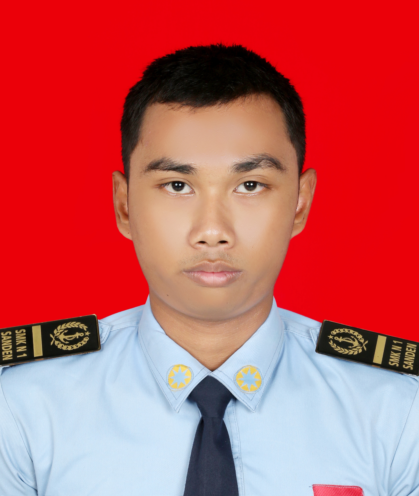

<!DOCTYPE html>
<html>
<head>

</head>
<body>

<!-- FOTO DI TENGAH -->

  
  <h1 class="nama">[AMMAR HAYYAN PADMA YUDHISTIRA]</h1>
  
Siswa SMK Rekayasa Perangkat Lunak (RPL) • Web Development • Database • Git/GitHub

<!-- DATA DIRI - FORMAT SAMA SEPERTI PENDIDIKAN -->
<h2 class="h2">DATA DIRI</h2>

  NAMA: Ammar Hayyan Padma Yudhistira

  TTL: Yogyakarta 11 April 2008

  ALAMAT:Jl. Letdjen Suprapto Gedrian RT-02 Bantul Bnatul
  

  

  JENIS KELAMIN:Laki-laki

  AGAMA:Islam

  

   
 📱 085726374971  📧 ammarhayyan80@gmail.com   🔗github.com/yudhistira28

<h2 class="h2">PROFIL</h2>

   Siswa jurusan Rekayasa Perangkat Lunak yang memiliki pengetahuan dasar tentang pengembangan perangkat lunak, desain basis data, serta pengembangan web. Menguasai keterampilan dasar seperti HTML, CSS, JavaScript, dan pengelolaan data menggunakan MySQL, serta memiliki pengalaman menyelesaikan proyek sekolah sederhana. Bersemangat untuk menerapkan ilmu yang didapat di sekolah ke dalam dunia kerja nyata, siap belajar dari tenaga ahli, bekerja sama dalam tim, dan memberikan kontribusi positif dengan sikap yang bertanggung jawab dan teliti selama masa PKL.
  

<h2 class="h2">PENDIDIKAN</h2>

  SD:2015-2021 
  SD Muhammaddiyah Bantul Kota

  SMP:2021-2024 
  SMP Muhammaddiyah Jetis

  SMK:2024-2027 
  SMKN 1 Sanden

<h2 class="h2">SKILL</h2>

  PHP 
  MySQL
  HTML
  JavaScript
  Python
  Git & GitHub

<h2 class="h2">PROYEK</h2>

   Membuat databases sederhana  
    Membuat dan mengelola database menggunakan MariaDB. 
  Membuat Website sederhana
     Membuat tampilan website sederhana dengan tampilan responsif.  
   Membuat game sederhana
     Membuat game permainan yang menarik dengan secracth.  

<h2 class="h2">TUJUAN PKL</h2>

  Siap belajar dan berkontribusi di tim IT. Ingin praktik skill programming di dunia kerja.

  HORMAT SAYA 
  <strong>Ammar hayyan padma yudhistira</strong>

</body>
</html>
